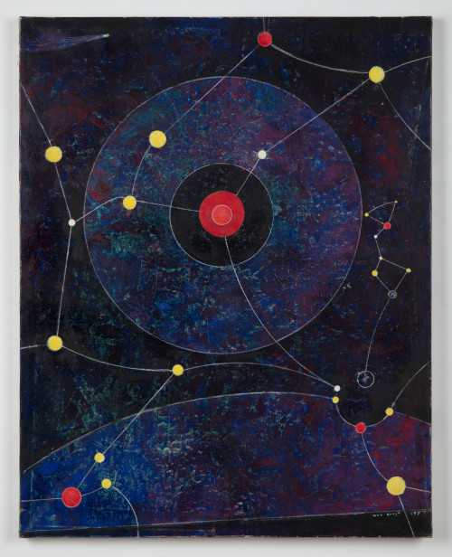

# Katabasis

A probabilistic, distributed, relational database management system.

Written in Rust and MIT-licensed.

## Introduction

[Katabasis](https://en.wikipedia.org/wiki/Katabasis), Greek for "journey to the
underworld", is a distributed, relational database management system that
natively supports probabilistic inference.

The motivation behind Katabasis is to filter signal from noise in real time,
under conditions of variable (and not reliably measurable) uncertainty.

Possible use cases for Katabasis include real-time data analysis of security
events, physical phenomena, and economic time series.

## Author

Marco Piedra Venegas (<mpiedrav@proton.me>)

## License

[MIT](<https://spdx.org/licenses/MIT.html>)

## Credits

Profile picture is "Configuration" (1974) by Max Ernst at Kasmin Gallery
(<https://www.kasmingallery.com/artists/19-max-ernst/works/29275-max-ernst-configuration-1974/>)
